# Node.js RevDeBug Demo Application
This project demonstrates how to integrate RevDeBug into a Node.js Express application to monitor server and client interactions, trace errors, and record performance metrics.

## Overview
RevDeBug is a powerful debugging tool that provides:

- Server-side monitoring: Capture performance metrics and trace execution within the Node.js backend.
- Client-side recording: Record user interactions and screen activity in the browser.
- Error tracking: Record and replay errors in real time, allowing for detailed inspection of application failures.
This demo showcases how RevDeBug can help track bugs and monitor the behavior of both the backend server and the frontend client in a typical web application.

## Setup Instructions
### Prerequisites
Ensure the following tools are installed on your system:

Node.js (version 18 or higher)
RevDeBug npm module (either globally or locally installed)
### Installation Steps
#### Clone the project
Go to the directory where you want to clone the repository:
```sh
git clone https://github.com/RevDeBug/revdebug-tutorial-react-js
```
Configure RevDeBug's npm registry:
``` bash
npm config set @revdebug:registry https://nexus.revdebug.com/repository/npm/

```

Install the required dependencies:

``` bash
npm install
npm install @revdebug/revdebug
```
### RevDeBug Configuration
Set up RevDeBug's configuration:

``` bash
{
   "host": "revdebug.server",
   "secure": true,
   "apm": true,
   ".server": {
       "application": "Node.js Application Server",
       "target": "node",
       "solution": "revdebug-tutorial-nodeweb-server",
       "files": ["app.js", "ErrorHandler.js"]
   },
   ".client": {
       "solution": "revdebug-tutorial-nodeweb-client",
       "application": "Node.js Application Client",
       "useFMP": true,
       "screen": true,
       "target": "web",
       "sourceMap": true,
       "path": "public",
       "files": "**/*.js",
       "index": "views/index.ejs",
       "type": "module",
       "mode": "onevent",
       "entrySpan": "multi",
       "sw_cold_endpoint": true
   }
}
```

Instrument the project with RevDeBug:

``` bash
npx revd
```
Start the Node.js application:

``` bash
node app.js
```
The server will start on http://localhost:3000.


## Running with Docker
To run the NodeJs application using Docker, follow these steps:

Before running, configure revdebug.json. See [here](#revdebug-configuration) for how to do it.

Build the Docker image:
```bash
docker-compose build
```
Run the Docker container:
```bash
docker-compose up
```
Access the application at http://localhost:3000.
 

## Connect code repository
Go to settings appliacation. 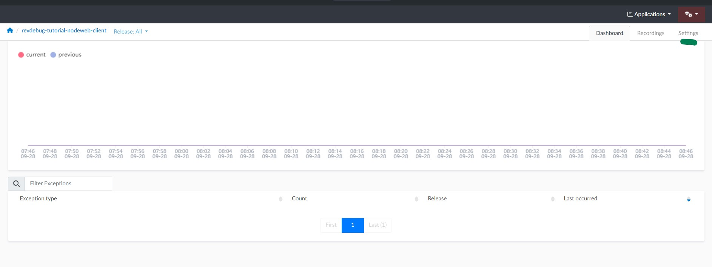 Follow the “connect to repository” option and fill the “Repository address” to github repository location of https://github.com/RevDeBug/revdebug-tutorial-nodeweb and press “Save”.
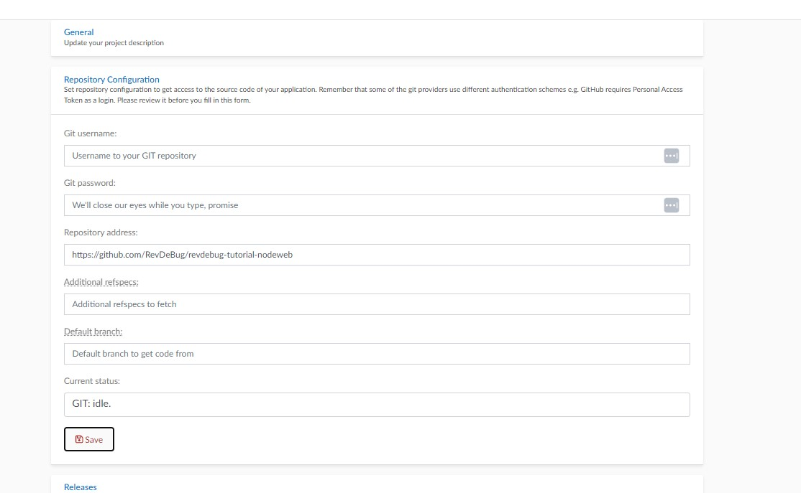

## Demonstrating Errors in the Application

The demo application includes pages with intentionally introduced bugs to show how RevDeBug captures errors and traces them.

### 1. Fetch Error Monitoring

RevDeBug allows you to monitor requests sent from the frontend and visualize them in the APM trace. This feature is particularly useful for tracking and diagnosing issues related to API calls or any requests made by the application.

#### Steps to Reproduce:

1. Open the application in your browser:  
   Navigate to [http://localhost:3000/](http://localhost:3000/).  
   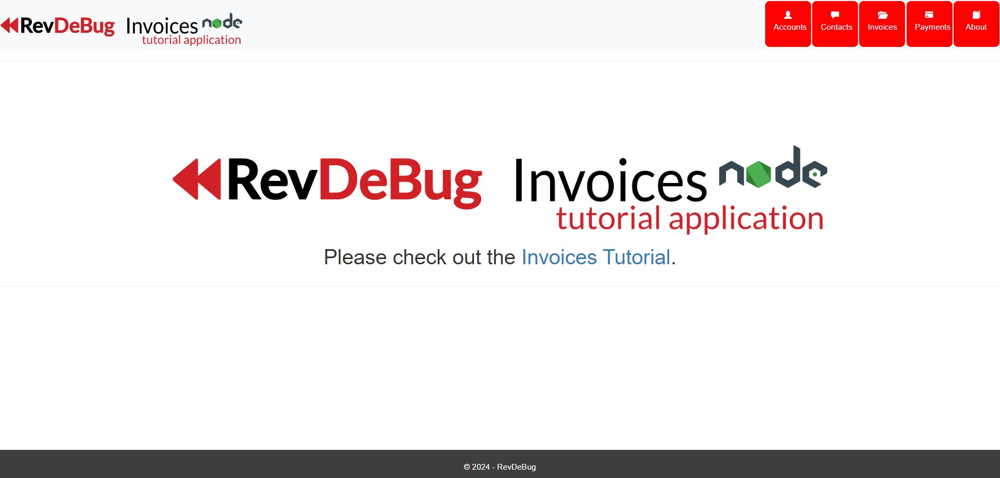
   
2. Click on **Invoices Tutorial** in the navigation bar.  
   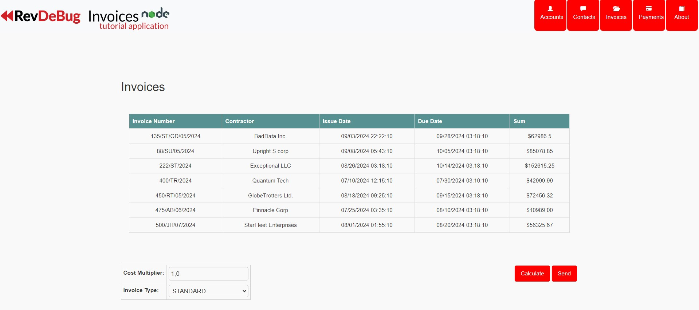

3. Click the **Send** button to trigger the request.  
   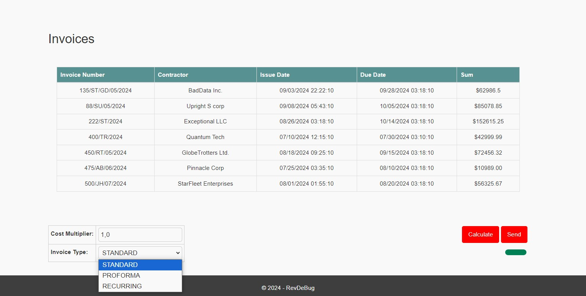
   - If you leave Invoice Type set to STANDARD, an error will be returned; however, if you change it to another option, the request will succeed.

4. Now, go to your **RevDeBug server** and navigate to `/apm/trace`. After a few seconds, the fetch request failure will appear in the trace.  
   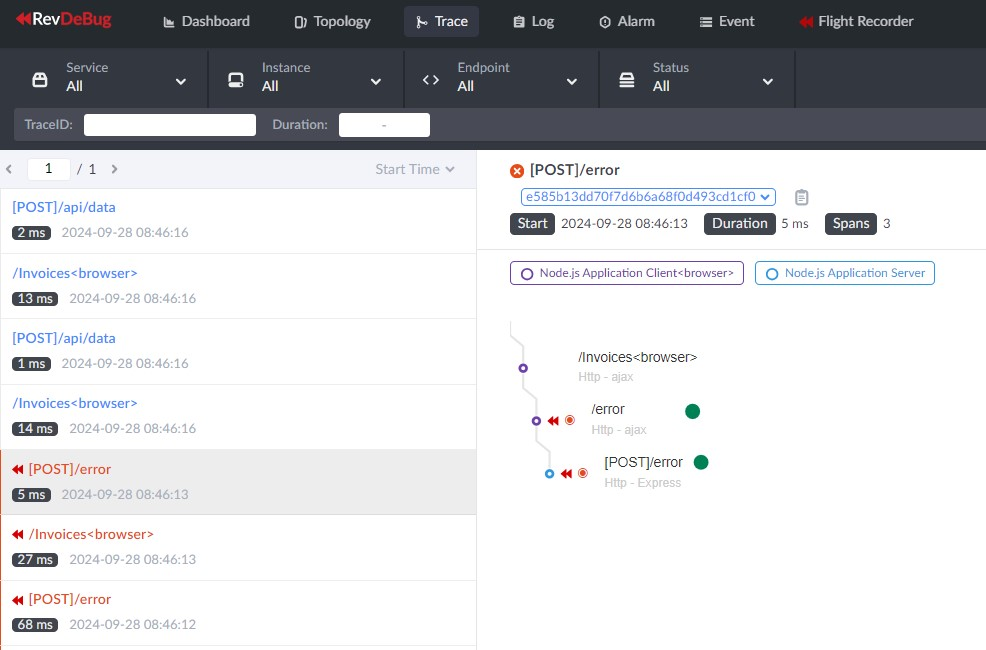
   

5. By clicking on the specific trace node for the failed request, you can inspect further details.  
   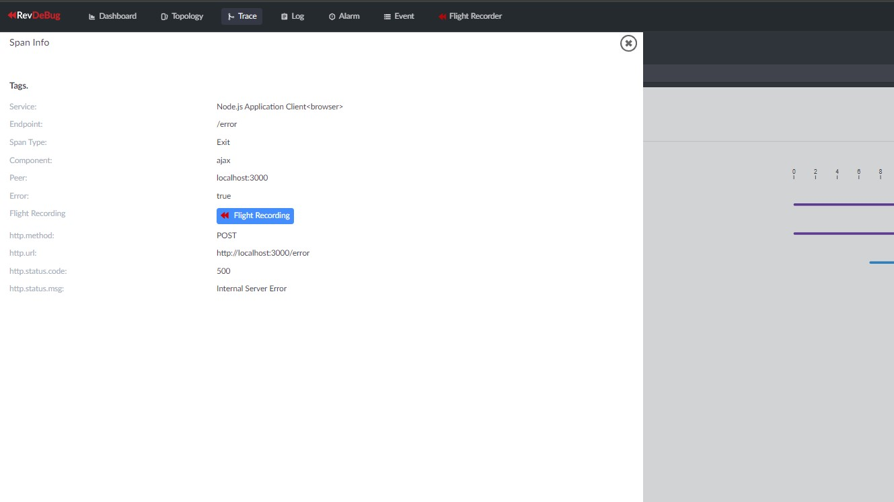

6. From the trace node, you can access the **error recording** for this specific failure, where you can replay the user action and inspect the exact cause of the error.   
   

This trace visualization allows you to track the flow of requests, analyze failures, and pinpoint the root cause of the problem efficiently.

### 2. User Input Error Monitoring

In the RevDeBug server, you can inspect the recording to trace the steps taken by the user, allowing you to follow the exact sequence that led to the issue and identify the root cause effectively.

#### Steps to Reproduce:

1. While remaining on the **Invoices Tutorial** page, set the input to a value greater than 10 and change the select to either **Proforma** or **Recurring**.  
   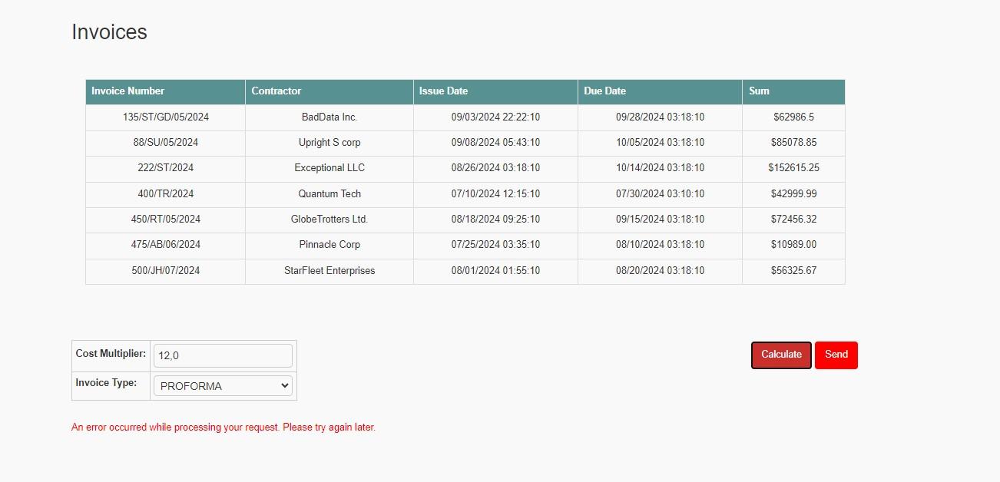

2. Click the **Calculate** button to trigger the calculation and send the request.

3. Now, navigate to your **RevDeBug server** and go to `/apm/monitor`. Click on **Applications**.  
   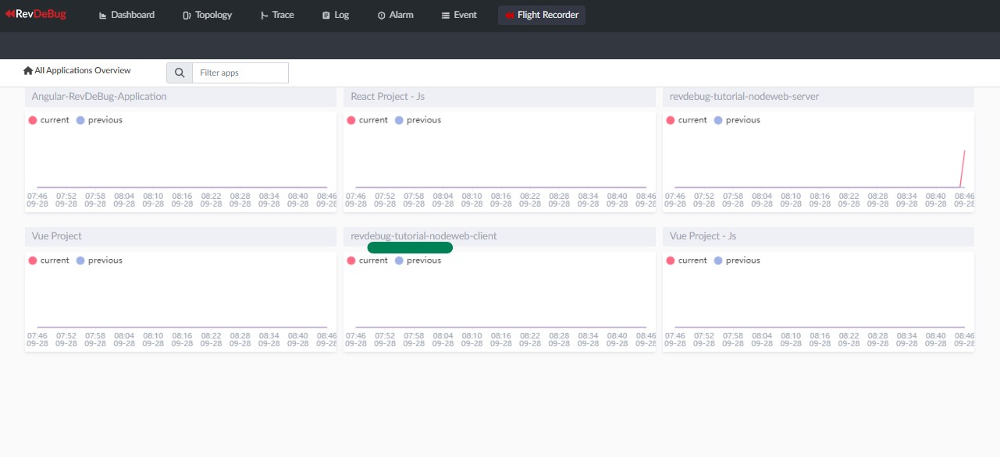

4. On the **Applications** page, you will see a table of exceptions with every error that occurred in the application and was captured. Click on a selected error to view its recording.  
   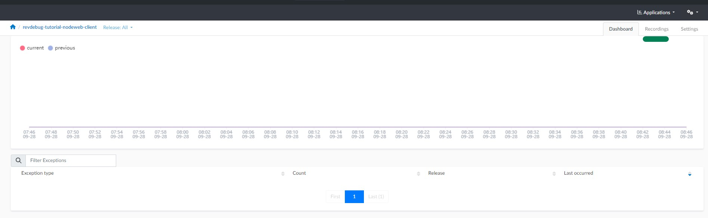

5. You can now review the stack trace for the occurrence of the error and watch the recording of user actions on the page that led to the error.  
   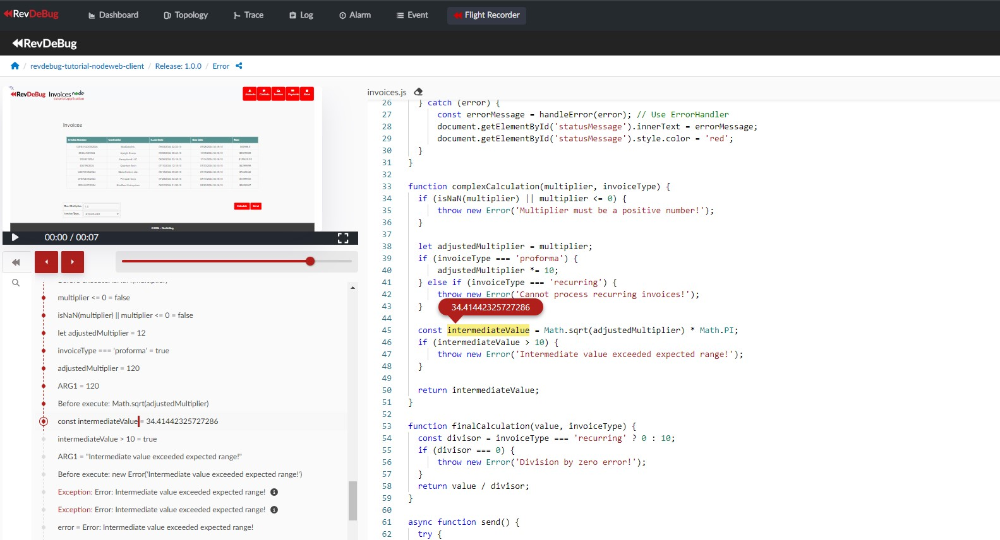  
   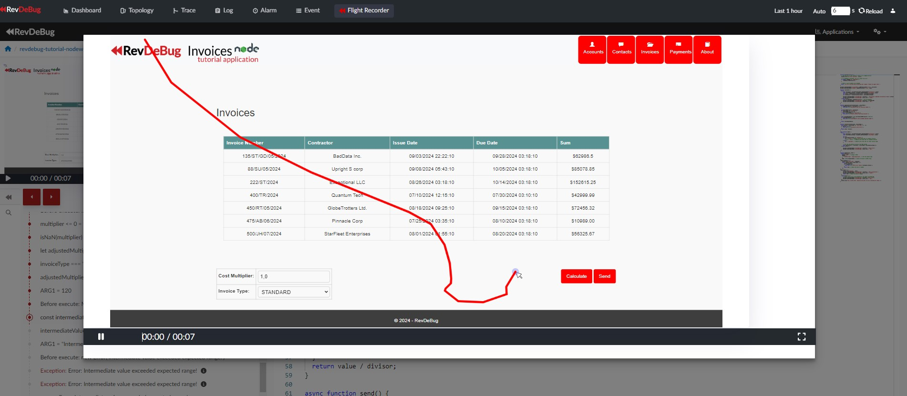

## Benefits of Using RevDeBug 

By using RevDeBug, you can:

- Save time: Quickly identify and resolve the root cause of issues by replaying exact user sessions.
- Improve user experience: Track application performance and optimize it based on real-world usage.
- Reduce costs: Spend less time debugging and more time building new features, leading to faster delivery and lower maintenance costs.

For detailed documentation, refer to <a href="https://revdebug.gitbook.io/revdebug/supported-langauges/javascript">RevDeBug Official Documentation</a>.